```mermaid
flowchart LR
    classDef mining  fill:#3d2006,stroke:#cd853f,color:#ffe8cc
    classDef herb    fill:#0f3320,stroke:#52b788,color:#d8f3dc
    classDef lumber  fill:#3b2a1a,stroke:#a0522d,color:#ffd700
    classDef fish    fill:#0d2a3d,stroke:#4fc3f7,color:#b3e5fc
    classDef jc      fill:#071830,stroke:#4183c4,color:#cce5ff
    classDef ins     fill:#1e0a30,stroke:#9c27b0,color:#e1bee7
    classDef alc     fill:#2a0e00,stroke:#ff6d00,color:#fff3e0
    classDef enc     fill:#050520,stroke:#3f51b5,color:#c5cae9
    classDef tailor  fill:#2a1a2a,stroke:#ab47bc,color:#f3e5f5
    classDef fin     fill:#003322,stroke:#26a69a,color:#b2dfdb,font-weight:bold
    classDef gear    fill:#222,stroke:#78909c,color:#cfd8dc

    %% ══════════════════════════════════════════════════
    %% LAYER 1 — RAW MATERIALS
    %% ══════════════════════════════════════════════════

    subgraph GATHER["Gathering (Raw Materials)"]
        direction TB
        ORE["Ore\nRefulgentCopper · UmbralTin\nBrilliantSilver · DazzlingThorium"]:::mining
        ORE_RARE["TormentedTantalum\n★ rare ore"]:::mining
        HERBS["Herbs\nTranquilityBloom · Argentleaf\nManaLily · Sanguithorn · Azeroot"]:::herb
        NLOTUS["NocturnalLotus\n★ rare herb"]:::herb
        MOTE_R["Mote (raw)\n[Herbalism & Mining]"]:::herb
        LUMBER["Lumber\nThalassianLumber · FelwoodLumber"]:::lumber
        FISH["Fish (Fishing)\nEversongTrout · BloomtailMinnow\nSin'doreiSwarmer"]:::fish
        PETRIFIED["PetrifiedRoot\n[Herbalism/World]"]:::herb
        TAIL_RAW["Raw Cloth (humanoid mob drops)"]:::tailor
    end

    %% ══════════════════════════════════════════════════
    %% JEWELCRAFTING
    %% ══════════════════════════════════════════════════

    subgraph JC["JewelCrafting"]
        direction TB

        subgraph JC_SMELT["Smelting (Mining skill)"]
            INGOT["Ingots\nCopper · Tin · Silver"]:::jc
        end

        subgraph JC_PROS["Prospecting"]
            GEMS["Uncommon Gems\nAmaniLapis · HarandarPeridot\nSanguineGarnet · TenebrousAmethyst"]:::jc
            FGEMS["Flawless Gems\nFlawlessAmaniLapis\nFlawlessHarandarPeridot\nFlawlessSanguineGarnet\nFlawlessTenebrousAmethyst"]:::jc
            EV_DIAMOND["EversongDiamond\n★ rare proc\n(spec-gated)"]:::jc
            DSTONE["DuskshroudedStone\n(byproduct)"]:::jc
            CGLASS["CrystallineGlass\n(byproduct)"]:::jc
        end

        subgraph JC_CUT["Gem Processing"]
            GGD["GlimmeringGemdust\n3 gems crushed → 1 dust"]:::jc
            CUTGEM["CutGem\n(stat variants:\nDeadly·Masterful\nQuick·Versatile)"]:::fin
            FLAWLESS_CUT["Flawless CutGem\n(higher stat budget)"]:::fin
        end

        subgraph JC_META["Meta Gems (EversongDiamond + 2x PetrifiedRoot)"]
            META["MetaGems\nPowerful · Telluric\nStoic · Indecipherable\nEversong Diamond"]:::fin
        end

        subgraph JC_PRISM["Kaleidoscopic Prism"]
            PRISM["KaleidoscopicPrism\n1x each Flawless gem\n+ 10x GlimmeringGemdust"]:::jc
            PRISM_OUT["4–6x random\nFlawless Gems\n(arbitrage)"]:::fin
        end

        subgraph JC_CRAFT["Vials & Lenses"]
            SVIAL["SunglassVial\n(CrystallineGlass)"]:::jc
            SLENS["Sin'doreiLens\n(CrystallineGlass)"]:::jc
        end

        subgraph JC_DECOR["JC Housing Decor\n(Lumber + Gems + Lens)"]
            JC_HOUSE["Bejeweled Sin'dorei Lyre\nBrilliant Phoenix Harp\nResplendent Highborne Statue\n+ 3 more"]:::fin
        end
    end

    %% ══════════════════════════════════════════════════
    %% INSCRIPTION
    %% ══════════════════════════════════════════════════

    subgraph INS["Inscription"]
        direction TB

        subgraph INS_MILL["Milling (herb-specific)"]
            PIGMENT["Pigments\nPowderPigment ← TranquilityBloom\nArgentleafPigment ← Argentleaf\nManaLilyPigment ← ManaLily\nSanguithornPigment ← Sanguithorn"]:::ins
        end

        SONGWATER["ThalassianSongwater\n(vendor-bought solvent)"]:::ins

        subgraph INS_INK["Ink Crafting (each: 3x Songwater + pigments)"]
            SIENNA["SiennaInk\n+20 Powder +10 Argentleaf\n+5 ManaLily pigments"]:::ins
            MUNSELL["MunsellInk\n+20 Powder +10 Sanguithorn\n+5 ManaLily pigments"]:::ins
        end

        subgraph INS_PROD["Key Products"]
            MISS["ThalassianMissive\n2x Munsell + 2x Sienna\n+ MoteOfPureVoid\n★ used in every crafted gear piece"]:::fin
            SOUL["SoulCipher\n1x Munsell + 1x Sienna\n+ MoteOfPureVoid + MoteOfLight\n+ DuskshroudedStone (JC!)"]:::fin
            DMC["DarkmoonCard\n(Munsell or Sienna Ink\n+ ThalassianEssenceOfTheFaire)\n→ 8 cards = DarkmoonDeck trinket"]:::fin
            CONTRACT["Faction Contracts\n(Inks)\n× 4 factions"]:::fin
        end
    end

    %% ══════════════════════════════════════════════════
    %% ALCHEMY
    %% ══════════════════════════════════════════════════

    subgraph ALC["Alchemy"]
        direction TB

        subgraph ALC_BYPRODUCT["Stabilized Derivate (byproduct)"]
            SD["StabilizedDerivate\n← recycle Flask or Potion\n(NOT crafted from herbs directly)"]:::alc
        end

        subgraph ALC_TRANS["Mote Transmutation Cycle\n(each: 10x input mote + 2x SD)"]
            MOL["MoteOfLight"]:::alc
            MOPE["MoteOfPrimalEnergy"]:::alc
            MOPV["MoteOfPureVoid"]:::alc
            MOWM["MoteOfWildMagic"]:::alc
        end

        subgraph ALC_INTER["Key Intermediates"]
            CF["CompositeFlora\n⏱ 4x MoteOfWildMagic\n+ 4x MoteOfPrimalEnergy\n+ 6x TranquilityBloom + 4x Argentleaf"]:::alc
            WS["WondrousSynergist\n⏱ 18 hr CD\n4x SD + 2x each:\nTranquilityBloom·Sanguithorn\nAzeroot·Argentleaf·ManaLily"]:::alc
        end

        subgraph ALC_POT["Potions (Herbs + Mote + 5x SunglassVial)"]
            POT_L["Light's Potential\n(MoteOfLight)"]:::fin
            POT_R["Potion of Recklessness\n(MoteOfPrimalEnergy)"]:::fin
            POT_V["Void-Shrouded Tincture\n(MoteOfPureVoid)"]:::fin
        end

        subgraph ALC_PHIAL["Phials (Herbs + Mote + 4x SunglassVial)"]
            PHIAL_F["Haranir Phial of Finesse\n(MoteOfPrimalEnergy)"]:::fin
            PHIAL_I["Haranir Phial of Ingenuity\n(MoteOfPureVoid)"]:::fin
            PHIAL_P["Haranir Phial of Perception\n(MoteOfWildMagic)"]:::fin
        end

        subgraph ALC_FLASK["Flasks (NocturnalLotus + Mote + Herbs + 2x SunglassVial)"]
            FL_BK["Flask of the Blood Knights\n(MoteOfWildMagic)"]:::fin
            FL_MA["Flask of the Magisters\n(MoteOfPureVoid)"]:::fin
            FL_SS["Flask of the Shattered Sun\n(MoteOfPrimalEnergy)"]:::fin
            FL_TR["Flask of Thalassian Resistance\n(MoteOfLight)"]:::fin
        end

        subgraph ALC_CAULD["Cauldrons (raid gold-sink)\nNocturnalLotus + 5x SD + 4x PetrifiedRoot\n+ 20x SunglassVial + 4x WondrousSynergist"]
            CAULD_F["Cauldron of Sin'dorei Flasks\n150k–400k gold each"]:::fin
            CAULD_P["Voidlight Potion Cauldron"]:::fin
        end

        subgraph ALC_GEMS["School of Gems (Fishing × Alchemy)\n4x EversongTrout + 12x BloomtailMinnow\n+ 20x Sin'doreiSwarmer\n+ 1x SD + 3x CompositeFlora"]
            SOG["SchoolOfGems\n→ random Uncommon\n+ Flawless Gems"]:::fin
        end

        subgraph ALC_STONE["Alchemist Stones (epic trinkets)"]
            PRIME_STONE["Primal Philosopher's Stone\n2x SD + 2x MoteOfLight"]:::fin
            MAG_STONE["Magister's Alchemist Stone\n5x SD + 8x MoteOfPrimalEnergy\n+ 8x MoteOfWildMagic\n+ TormentedTantalum★ + 2x WondrousSynergist"]:::fin
        end

        subgraph ALC_DECOR["Alchemy Housing Decor\n(all: WondrousSynergist + CompositeFlora\n+ ThalassianLumber + Motes)"]
            ALC_HOUSE["Sunsmoke Censer\n(MoteOfLight)\nSilvermoon Spire Fountain\n(WildMagic + PrimalEnergy)\nEntropic Illuminant\n(MoteOfPureVoid)\nRootbound Vat\n(MoteOfPrimalEnergy)\n+ Haranir Preserving Agents\n+ Riftstone"]:::fin
        end
    end

    %% ══════════════════════════════════════════════════
    %% ENCHANTING
    %% ══════════════════════════════════════════════════

    subgraph ENC["Enchanting"]
        direction TB

        subgraph ENC_DE["Disenchanting & Downgrades"]
            DUST["EversingingDust\n(common gear)"]:::enc
            RS["RadiantShard\n(rare gear)"]:::enc
            DC["DawnCrystal\n(epic gear)"]:::enc
        end

        subgraph ENC_OIL["Oils (cross-profession: SunglassVial from JC)"]
            PHX["ThalassianPhoenixOil\n5x MoteOfLight + 1x SunglassVial\n+ 5x EversingingDust"]:::fin
            OD["OilOfDawn (healer)\n5x MoteOfLight + 2x PetrifiedRoot\n+ 1x SunglassVial + 5x EversingingDust"]:::fin
        end

        subgraph ENC_WEP["High-Tier Weapon Enchants\n(also need Tailoring cloth bolts)"]
            WEP_AM["Enchant Weapon – Arcane Mastery\n5x MoteOfLight + 4x PetrifiedRoot\n+ 2x ArcanoweaveRolt (Tailoring)\n+ 20x Dust + 15x Shard + 2x Crystal"]:::fin
            WEP_FL["Enchant Weapon – Flames of the Sin'dorei\n5x MoteOfLight + 4x PetrifiedRoot\n+ 2x SunfireSilkBolt (Tailoring)\n+ 25x Dust + 15x Shard + 2x Crystal"]:::fin
        end

        subgraph ENC_RING["Ring Enchants (high volume, steady AH income)"]
            RING["Ring Enchants\nEversingingDust\n× 8 variants"]:::fin
        end
    end

    GEAR_C["Common Gear"]:::gear
    GEAR_R["Rare Gear"]:::gear
    GEAR_E["Epic Gear"]:::gear

    subgraph TAILORING["Tailoring"]
        direction TB
        
        subgraph TAIL_RAW["Raw Cloth (humanoid mob drops)"]
            BRIGHT_LINEN["BrightLinen\n(common, all zones)"]:::tailor
            ARCANOWEAVE["Arcanoweave\n★ spec-gated\n(Nimble Needlework 20 KP)"]:::tailor
            SUNFIRE_SILK["SunfireSilk\n★ spec-gated\n(Nimble Needlework 20 KP)"]:::tailor
        end

        subgraph TAIL_PROCESS["Cloth Processing"]
            LINEN_BOLT["BrightLinenBolt\n(weave BrightLinen)"]:::tailor
            IMBUED_BOLT["ImbuedBrightLinenBolt\n(imbue BrightLinenBolt)"]:::tailor
        end

        subgraph TAIL_BOLTS["Daily CD Bolts (~17 hr)\n→ consumed by Enchanting weapon enchants"]
            TAIL_A["ArcanoweaveRolt\n4x MoteOfWildMagic\n+ 5x Arcanoweave\n+ 6x ImbuedBrightLinenBolt"]:::tailor
            TAIL_S["SunfireSilkBolt\n4x MoteOfLight\n+ 5x SunfireSilk\n+ 6x ImbuedBrightLinenBolt"]:::tailor
        end

        BRIGHT_LINEN -->|weave| LINEN_BOLT
        LINEN_BOLT   -->|imbue| IMBUED_BOLT
        ARCANOWEAVE  -->|"5x + 6x Imbued"| TAIL_A
        SUNFIRE_SILK -->|"5x + 6x Imbued"| TAIL_S
        IMBUED_BOLT  -->|"6x"| TAIL_A
        IMBUED_BOLT  -->|"6x"| TAIL_S
    end

    %% ══════════════════════════════════════════════════
    %% CONNECTIONS
    %% ══════════════════════════════════════════════════

    %% Mining → JC
    ORE -->|smelt| INGOT
    ORE -->|"prospect"| GEMS
    ORE -->|"prospect\n(rare proc★)"| FGEMS
    ORE -->|"prospect\n(spec-gated★)"| EV_DIAMOND
    ORE -->|prospect| DSTONE
    ORE -->|prospect| CGLASS

    ORE_RARE -.->|"Mining★ → Alchemy"| MAG_STONE

    %% JC processing
    GEMS -->|"crush\n(3→1)"| GGD
    GEMS -->|cut| CUTGEM
    FGEMS -->|cut| FLAWLESS_CUT
    FGEMS -->|crush| GGD

    CGLASS -->|"craft vial"| SVIAL
    CGLASS -->|"craft lens"| SLENS

    %% Kaleidoscopic Prism
    FGEMS -->|"1x each +\n10x Gemdust"| PRISM
    GGD -->|"10x"| PRISM
    PRISM -->|open| PRISM_OUT

    %% Meta gems
    EV_DIAMOND -->|"+ 2x PetrifiedRoot"| META
    PETRIFIED -->|ingredient| META

    %% JC decor
    LUMBER -->|ingredient| JC_HOUSE
    GEMS -->|ingredient| JC_HOUSE
    FGEMS -->|ingredient| JC_HOUSE
    SLENS -->|ingredient| JC_HOUSE

    %% Herbalism → Inscription
    HERBS -->|"mill\n(herb-specific)"| PIGMENT
    PIGMENT -->|"+ 3x Songwater"| SIENNA
    PIGMENT -->|"+ 3x Songwater"| MUNSELL
    SONGWATER -->|solvent| SIENNA
    SONGWATER -->|solvent| MUNSELL

    MUNSELL -->|"2x Munsell + 2x Sienna\n+ MoteOfPureVoid"| MISS
    SIENNA -->|ingredient| MISS
    MUNSELL -->|"+ MoteOfPureVoid\n+ MoteOfLight\n+ DuskshroudedStone"| SOUL
    SIENNA -->|ingredient| SOUL
    MUNSELL -->|"+ Essence"| DMC
    SIENNA -->|ingredient| DMC
    MUNSELL -->|craft| CONTRACT
    SIENNA -->|ingredient| CONTRACT

    %% Cross-profession: JC DuskshroudedStone → Inscription SoulCipher
    DSTONE -.->|"JC → Inscription\n(SoulCipher ingredient)"| SOUL

    %% Alchemy: Herb/Mote → StabilizedDerivate (via recycle)
    HERBS -->|"brew Potion/Flask\nthen recycle"| SD
    MOTE_R -->|"gather"| MOL
    MOTE_R -->|"gather"| MOPE
    MOTE_R -->|"gather"| MOPV
    MOTE_R -->|"gather"| MOWM

    %% Mote transmutation cycle
    MOL  -->|"10x + 2x SD"| MOWM
    MOWM -->|"10x + 2x SD"| MOPV
    MOPV -->|"10x + 2x SD"| MOPE
    MOPE -->|"10x + 2x SD"| MOL

    %% CompositeFlora
    MOWM -->|"4x"| CF
    MOPE -->|"4x"| CF
    HERBS -->|"TranquilityBloom\n+ Argentleaf"| CF

    %% WondrousSynergist
    SD   -->|"4x"| WS
    HERBS -->|"2x each herb"| WS

    %% Potions (Herbs + Mote + SunglassVial)
    HERBS -->|ingredient| POT_L
    HERBS -->|ingredient| POT_R
    HERBS -->|ingredient| POT_V
    MOL  -->|mote| POT_L
    MOPE -->|mote| POT_R
    MOPV -->|mote| POT_V
    SVIAL -.->|"JC → Alchemy\n(5x per potion)"| POT_L
    SVIAL -.->|ingredient| POT_R
    SVIAL -.->|ingredient| POT_V

    %% Phials (Herbs + Mote + SunglassVial)
    HERBS -->|ingredient| PHIAL_F
    HERBS -->|ingredient| PHIAL_I
    HERBS -->|ingredient| PHIAL_P
    MOPE -->|mote| PHIAL_F
    MOPV -->|mote| PHIAL_I
    MOWM -->|mote| PHIAL_P
    SVIAL -.->|"JC → Alchemy\n(4x per phial)"| PHIAL_F
    SVIAL -.->|ingredient| PHIAL_I
    SVIAL -.->|ingredient| PHIAL_P

    %% Flasks (NocturnalLotus + Mote + Herbs + SunglassVial)
    NLOTUS -->|"★ 1x"| FL_BK
    NLOTUS -->|"★ 1x"| FL_MA
    NLOTUS -->|"★ 1x"| FL_SS
    NLOTUS -->|"★ 1x"| FL_TR
    HERBS -->|ingredient| FL_BK
    HERBS -->|ingredient| FL_MA
    HERBS -->|ingredient| FL_SS
    HERBS -->|ingredient| FL_TR
    MOWM -->|mote| FL_BK
    MOPV -->|mote| FL_MA
    MOPE -->|mote| FL_SS
    MOL  -->|mote| FL_TR
    SVIAL -.->|"JC → Alchemy\n(2x per flask)"| FL_BK
    SVIAL -.->|ingredient| FL_MA
    SVIAL -.->|ingredient| FL_SS
    SVIAL -.->|ingredient| FL_TR

    %% Cauldrons (require WondrousSynergist!)
    NLOTUS -->|ingredient| CAULD_F
    NLOTUS -->|ingredient| CAULD_P
    SD    -->|"5x"| CAULD_F
    SD    -->|"5x"| CAULD_P
    WS    -->|"4x"| CAULD_F
    WS    -->|"4x"| CAULD_P
    PETRIFIED -->|"4x"| CAULD_F
    PETRIFIED -->|"4x"| CAULD_P
    SVIAL -.->|"JC → Alchemy\n(20x per cauldron)"| CAULD_F
    SVIAL -.->|ingredient| CAULD_P

    %% School of Gems (Fishing × Alchemy)
    FISH -->|"EversongTrout·Bloomtail\nSin'doreiSwarmer"| SOG
    SD   -->|"1x"| SOG
    CF   -->|"3x"| SOG
    SOG  -->|"opens to"| GEMS
    SOG  -->|"opens to"| FGEMS

    %% Alchemist Stones
    SD   -->|"2x"| PRIME_STONE
    MOL  -->|"2x"| PRIME_STONE
    SD   -->|"5x"| MAG_STONE
    MOPE -->|"8x"| MAG_STONE
    MOWM -->|"8x"| MAG_STONE
    WS   -->|"2x"| MAG_STONE

    %% Decor (all: WS + CF + Lumber + Motes)
    WS    -->|"4x"| ALC_HOUSE
    CF    -->|"4x"| ALC_HOUSE
    LUMBER -.->|"Lumbering → Alchemy\n(12–40x)"| ALC_HOUSE
    MOL   -->|"mote"| ALC_HOUSE
    MOPE  -->|"mote"| ALC_HOUSE
    MOPV  -->|"mote"| ALC_HOUSE
    MOWM  -->|"mote"| ALC_HOUSE

    %% Gear → Enchanting disenchanting
    GEAR_C -->|disenchant| DUST
    GEAR_R -->|disenchant| RS
    GEAR_E -->|disenchant| DC
    DC -->|shatter| RS
    RS -->|pulverize| DUST

    %% Enchanting oils (cross-profession SunglassVial from JC)
    MOL  -->|"5x"| PHX
    MOL  -->|"5x"| OD
    DUST -->|"5x"| PHX
    DUST -->|"5x"| OD
    PETRIFIED -->|"2x"| OD
    SVIAL -.->|"JC → Enchanting\n(1x per oil)"| PHX
    SVIAL -.->|ingredient| OD

    %% Weapon enchants (Tailoring cloth bolts needed)
    MOL  -->|"5x"| WEP_AM
    MOL  -->|"5x"| WEP_FL
    DUST -->|"20–25x"| WEP_AM
    DUST -->|ingredient| WEP_FL
    RS   -->|"15x"| WEP_AM
    RS   -->|ingredient| WEP_FL
    DC   -->|"2x"| WEP_AM
    DC   -->|ingredient| WEP_FL
    PETRIFIED -->|"4x"| WEP_AM
    PETRIFIED -->|ingredient| WEP_FL
    %% Mote inputs into Tailoring daily CD bolts (cross-profession from Alchemy/Gathering)
    MOWM -.->|"Tailoring uses\n4x MoteOfWildMagic"| TAIL_A
    MOL  -.->|"Tailoring uses\n4x MoteOfLight"| TAIL_S

    TAIL_A -.->|"Tailoring → Enchanting\n(2x ArcanoweaveRolt)"| WEP_AM
    TAIL_S -.->|"Tailoring → Enchanting\n(2x SunfireSilkBolt)"| WEP_FL

    %% Ring enchants
    DUST -->|craft| RING
```

# WoW Professions — Reagent Flow Diagram (Midnight)

Open with **Ctrl+Shift+V** (VS Code Markdown Preview) to render.
Also viewable at [mermaid.live](https://mermaid.live) — paste the code block below.

**Conventions**
- Solid arrows `→` = transformation within a profession
- Dashed arrows `⤏` = cross-profession dependency
- `[qty]` = approximate crafting quantity required
- `★` = rare source / gated acquisition
- `⏱` = has cooldown (18 hr unless noted)

---

---

## Recipe Reference Tables

### JewelCrafting — Key Recipes

| Recipe | Ingredients | Output |
|--------|-------------|--------|
| **Prospecting** | 5x any Ore | Gems + DuskshroudedStone + CrystallineGlass |
| **Flawless gem drop** | 5x any Ore (rare proc) | FlawlessGem (★spec-gated) |
| **EversongDiamond drop** | 5x Ore (rare, spec-gated) | EversongDiamond ★ |
| **CutGem** | 1x Gem + GlimmeringGemdust | Stat-specific CutGem |
| **Crush** | 3x Gem | GlimmeringGemdust |
| **SunglassVial** | CrystallineGlass | SunglassVial |
| **Sin'doreiLens** | CrystallineGlass | Sin'doreiLens |
| **Meta gem cut** | 1x EversongDiamond + 2x PetrifiedRoot | Powerful/Telluric/Stoic/Indecipherable EversongDiamond |
| **Kaleidoscopic Prism** | 1x each Flawless gem + 10x GlimmeringGemdust | KaleidoscopicPrism → 4–6x FlawlessGem |

### Alchemy — Key Recipes

| Recipe | Key Ingredients | Output |
|--------|----------------|--------|
| **CompositeFlora** ⏱ | 4x MoteWildMagic + 4x MotePrimalEnergy + 6x TranquilityBloom + 4x Argentleaf | CompositeFlora |
| **WondrousSynergist** ⏱ 18hr | 4x SD + 2x each (Bloom/Sanguithorn/Azeroot/Argentleaf/ManaLily) | WondrousSynergist |
| **Flask** (all 4) | 1x NocturnalLotus★ + Mote + Herbs + 2x SunglassVial | Flask variant |
| **Phial** (all 3) | Mote + Herbs + 4x SunglassVial | Haranir Phial variant |
| **Potion** (key) | Mote + Herbs + 5x SunglassVial | Combat Potion |
| **Flask Cauldron** | 1x NocturnalLotus★ + 5x SD + 4x PetrifiedRoot + 20x SunglassVial + 4x WondrousSynergist | CauldronOfSin'doreiFlasks |
| **Potion Cauldron** | same as above | VoidlightPotionCauldron |
| **School of Gems** | 4x EversongTrout + 12x BloomtailMinnow + 20x Sin'doreiSwarmer + 1x SD + 3x CompositeFlora | SchoolOfGems → random Gems |
| **Decor** (all 6) | 4x WondrousSynergist + 4x CompositeFlora + Lumber + Motes | Housing Decor |
| **Magister's Stone** ★ | 5x SD + 8x MotePrimalEnergy + 8x MoteWildMagic + TormentedTantalum + 2x WondrousSynergist | Epic Trinket |

### Inscription — Key Recipes

| Recipe | Ingredients | Output |
|--------|-------------|--------|
| **Pigments** (4 types) | 5x specific Herb | Herb-specific Pigment |
| **SiennaInk** | 3x Songwater + 20x Powder + 10x ArgentleafPigment + 5x ManaLilyPigment | SiennaInk ×1 |
| **MunsellInk** | 3x Songwater + 20x Powder + 10x SanguithornPigment + 5x ManaLilyPigment | MunsellInk ×2 |
| **ThalassianMissive** | 2x MunsellInk + 2x SiennaInk + 1x MoteOfPureVoid | ThalassianMissive |
| **SoulCipher** ★ | 1x Munsell + 1x Sienna + MoteOfPureVoid + MoteOfLight + **DuskshroudedStone (JC)** | SoulCipher |
| **DarkmoonCard** | Munsell or SiennaInk + ThalassianEssenceOfTheFaire | Random card → 8 = DarkmoonDeck |

### Tailoring — Bolt Chain

| Step | Recipe | Ingredients | Output |
|------|--------|-------------|--------|
| 1 | Weave | BrightLinen (common mob drop) | BrightLinenBolt |
| 2 | Imbue | 2x BrightLinenBolt | ImbuedBrightLinenBolt |
| 3 | **ArcanoweaveRolt** ⏱ ~17hr | 4x MoteOfWildMagic + 5x Arcanoweave★ + 6x ImbuedBrightLinenBolt | ArcanoweaveRolt |
| 3 | **SunfireSilkBolt** ⏱ ~17hr | 4x MoteOfLight + 5x SunfireSilk★ + 6x ImbuedBrightLinenBolt | SunfireSilkBolt |

★ `Arcanoweave` and `SunfireSilk` are spec-gated rare cloth drops (Nimble Needlework, 20 KP) from humanoid mobs. Fully specced Needlework halves the bolt cooldown to ~8.5 hr and raises the stack cap to 30.

### Enchanting — Key Recipes

| Recipe | Ingredients | Output |
|--------|-------------|--------|
| **Thalassian Phoenix Oil** | 5x MoteOfLight + 1x SunglassVial (JC) + 5x EversingingDust | Oil |
| **Oil of Dawn** | 5x MoteOfLight + 2x PetrifiedRoot + 1x SunglassVial (JC) + 5x EversingingDust | Healer Oil |
| **Enchant Weapon – Arcane Mastery** | 5x MoteOfLight + 4x PetrifiedRoot + 2x ArcanoweaveRolt (Tailoring) + 20x Dust + 15x Shard + 2x Crystal | Weapon Enchant |
| **Enchant Weapon – Flames of the Sin'dorei** | 5x MoteOfLight + 4x PetrifiedRoot + 2x SunfireSilkBolt (Tailoring) + 25x Dust + 15x Shard + 2x Crystal | Weapon Enchant |
| **Ring Enchant** (8 variants) | EversingingDust | Ring Enchant |

---

## Key Cross-Profession Dependency Map

| Source | Reagent | Consumer | Used In |
|--------|---------|----------|---------|
| JewelCrafting | SunglassVial | Alchemy | All Flasks (2x), Phials (4x), Potions (5x), Cauldrons (20x) |
| JewelCrafting | SunglassVial | Enchanting | Thalassian Phoenix Oil, Oil of Dawn (1x each) |
| JewelCrafting | DuskshroudedStone | Inscription | SoulCipher (1x) |
| Lumbering | ThalassianLumber | Alchemy | All housing decor (12–40x) |
| Lumbering | ThalassianLumber | JewelCrafting | JC housing decor |
| Mining | TormentedTantalum ★ | Alchemy | Magister's Alchemist Stone (1x) |
| Alchemy | WondrousSynergist | Alchemy | Decor (4x), Cauldrons (4x), MagisterStone (2x) |
| Alchemy | CompositeFlora | Alchemy | Decor (4x), School of Gems (3x) |
| Fishing | EversongTrout + Fish | Alchemy | School of Gems |
| Tailoring | ArcanoweaveRolt | Enchanting | Arcane Mastery Weapon Enchant (2x) |
| Tailoring | SunfireSilkBolt | Enchanting | Flames of the Sin'dorei Enchant (2x) |
| Alchemy/Gathering | MoteOfWildMagic | Tailoring | ArcanoweaveRolt (4x per bolt) |
| Alchemy/Gathering | MoteOfLight | Tailoring | SunfireSilkBolt (4x per bolt) |
